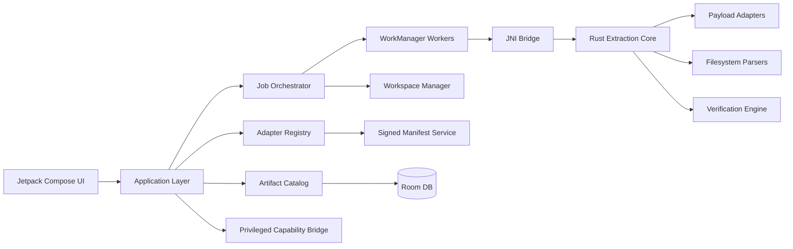
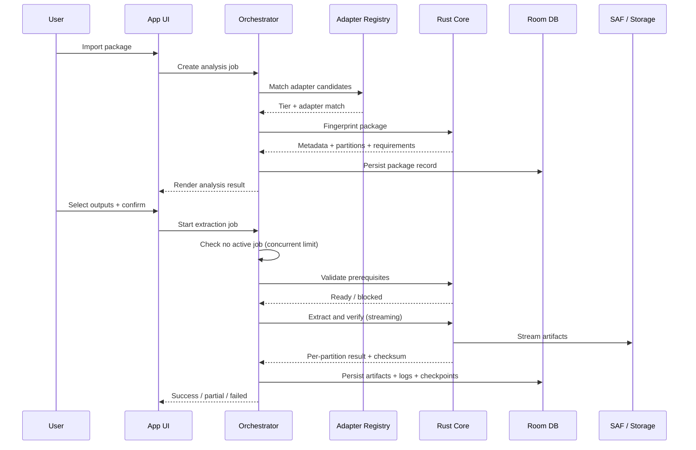
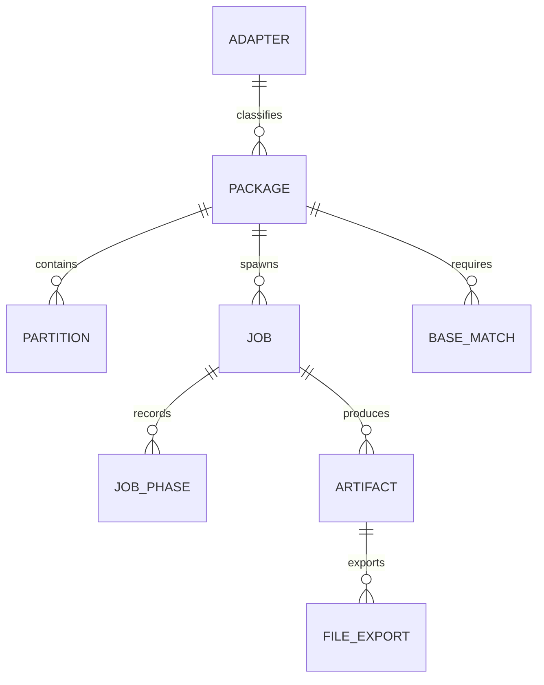
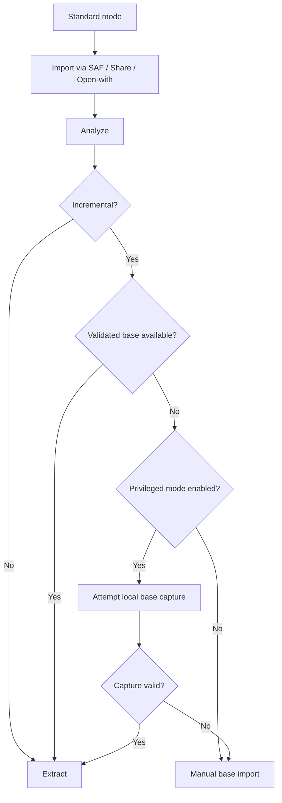

# Forge OTA Lab — Production PRD

## Document Status

| Field | Value |
|---|---|
| **Owner** | Product / Founder |
| **Date** | 2026-04-12 |
| **Status** | Final — ship-ready v1 |
| **Target release** | Closed beta in 6 weeks; public beta in 10 weeks |
| **Platform** | Android 11+ (API 30), phone and tablet |
| **Stack** | Kotlin + Jetpack Compose app shell, Rust extraction core via JNI, Room, WorkManager, Storage Access Framework |
| **Release posture** | Local-first, offline-capable, Play-distributed with direct APK fallback |
| **Decisions resolved** | Launch adapter set, platform scope, support tier policy, monetization posture, diagnostics policy, rollout controls, concurrent job policy |

---

## Summary

Forge OTA Lab is an Android-first mobile app for importing Android OTA packages, classifying them truthfully, extracting verifiable partition images, reconstructing supported incremental outputs when exact base inputs are available, and exporting read-only artifacts directly from a phone or tablet.

The product is a **format-aware extraction workbench** with explicit support tiers:
- **Supported:** deterministic extraction with verification and recovery behavior fully specified
- **Experimental:** extraction path exists, but one or more verification, recovery, or compatibility guarantees are weaker
- **Forensic:** package opens, fingerprints, and exposes metadata or raw contents, but full extraction is not promised

That honesty is the product. Users need to know what the package is, what is extractable, what is blocked, why it is blocked, and whether the output is trustworthy.

The v1 launch focuses on the highest-value, technically coherent slice:
1. **Google / Pixel-style payload-based full OTAs**
2. **Standard payload.bin families that match supported update_engine semantics without OEM encryption or proprietary wrapping**
3. **Incremental payload-based OTAs only when the app can validate exact base inputs** (Experimental tier)
4. **Standalone image import and export workflows for boot-critical images**

Everything else is tiered honestly instead of promised recklessly.

---

## Problem

Android OTA extraction is fragmented, desktop-heavy, failure-prone, and opaque.

Users who need `boot.img`, `init_boot.img`, `vendor_boot.img`, `vbmeta.img`, `dtbo.img`, `super.img`, or logical partition artifacts typically chain together desktop scripts, shell commands, community binaries, and forum instructions. That breaks down in five ways:

1. **Format ambiguity.** Users often cannot tell whether an archive is full, incremental, A/B, dynamic-partition, or OEM-customized. Existing tools assume the user already knows.
2. **Toolchain fragility.** Most tools assume Linux, Python, shell access, or device-specific knowledge. payload-dumper-go (4.2k+ GitHub stars) requires a desktop and CLI proficiency. Termux + Python scripts require dependency management and fail silently.
3. **Incremental misunderstanding.** Users frequently do not understand that deltas require the correct source build or source partition image set. Existing tools either crash or silently produce corrupt images.
4. **Failure opacity.** Existing tools fail with low-context errors — "extract failed" — rather than actionable guidance about what went wrong and what to try next.
5. **Trust gap.** Users cannot easily tell whether an exported image is direct, reconstructed, partial, slot-specific, stale, or invalid.

The result is wasted time, repeated downloads, misinformation, broken modding workflows, and avoidable user error.

### Evidence

- payload-dumper-go: 4.2k+ stars, 500+ forks — strong demand signal for extraction tooling
- Payload-Dumper-Android (Rajmani7584): 1k+ stars with 80+ open issues requesting verification, Samsung support, incremental OTA handling, and better UI
- XDA Forums: Dozens of threads asking "how to extract boot.img on phone without PC"
- r/Magisk: Recurring posts about failed root attempts due to wrong boot.img extraction

---

## Why Now

1. **Modern OTA complexity has outgrown hobbyist workflows.** Dynamic partitions, Virtual A/B, payload-based updates, and boot image variants (init_boot.img since Android 13/GKI 2.0) have raised the technical bar beyond what casual scripts handle reliably.
2. **Monthly security updates create monthly extraction needs.** Every Pixel, OnePlus, and Xiaomi user who runs Magisk must re-extract and re-patch `boot.img` or `init_boot.img` monthly. This is recurring infrastructure, not a one-time task.
3. **Mobile hardware is now good enough.** Recent Android devices can stream multi-GB archives, run native binary parsing, and sustain long-running local jobs without requiring a laptop.
4. **The market gap is still open.** No polished, mobile-native, local-first OTA extraction tool treats truthfulness and recoverability as first-class product behavior.
5. **A narrow, honest launch is feasible.** A focused adapter architecture lets the product ship a valuable slice without pretending all OEM ecosystems are solved on day one.

---

## Product Thesis

A great OTA extractor is not just an unpacker. It is a **decision engine** that answers six questions immediately:

1. What kind of package is this?
2. What can I extract right now?
3. What can I not extract yet?
4. Why is it blocked?
5. What exact prerequisite is missing?
6. How trustworthy is each output?

If the product gets those six answers right, advanced users will trust it. If it gets only extraction right and truth wrong, it will fail.

---

## Users and Jobs to Be Done

### Primary Users

**Magisk / root enthusiasts.** Need `boot.img` or `init_boot.img` from a downloaded OTA to patch with Magisk — all on their phone. Monthly frequency, aligned with security patch cycles. Current workflow takes 15–30 minutes per update cycle.

**ROM maintainers.** Need repeatable extraction of verified partitions, build metadata, and delta clarity. Work with multiple OTA files across different OEM brands and Android versions. Weekly to daily frequency during active development.

**Reverse engineers / security researchers.** Need archive fingerprinting, partition inspection, filesystem browsing, and diagnostics. Diff partition images between security patch levels. Monthly, aligned with Android Security Bulletin.

### Secondary Users

**Repair technicians** — need portable firmware artifact inspection without a desktop.
**Power users and modders** — lower frequency, driven by curiosity or community guides.
**Firmware archivists** — need metadata and classification for collection management.

### Jobs to Be Done

- "Tell me if this OTA is worth working with before I waste time."
- "Extract only the partitions I need, on-device."
- "Explain whether this is incremental and exactly what base artifacts are required."
- "Let me resume a long extraction without starting over."
- "Show me whether this output is direct, reconstructed, partial, or unsupported."
- "Give me logs I can actually use when something fails."

---

## Product Principles

1. **Truth over bravado.** Unsupported and partial states must be explicit. No green success state before verification completes.
2. **Local-first by default.** User packages and outputs stay on-device unless the user exports them.
3. **Verification before victory.** No success indicator before checksum or structural verification completes.
4. **Explain the failure.** Every blocked or failed state needs an actionable next step — not "something went wrong."
5. **Fast for experts, safe for everyone else.** Power features exist, but only behind clear guardrails.
6. **No destructive actions in v1.** The app analyzes and extracts. It does not flash, patch in place, or fetch OEM firmware.
7. **A narrow launch beats a dishonest broad launch.** Adapter coverage expands through signed manifests and release trains, not marketing promises.

---

## Goals

Measured by 90 days after public beta:

| # | Goal | Metric | Target | Guardrail |
|---|---|---|---|---|
| G1 | Supported-tier extraction success rate | Verified completion of supported-tier jobs / all supported-tier jobs started | ≥ 93% | Crash-free sessions must remain ≥ 99.5%. Wrong-output reports ≤ 1.5%. |
| G2 | Time to first verified artifact | Median time from import to first verified partition export for supported full OTAs | ≤ 3 minutes | Extraction must not cause ANR. Memory ≤ 350 MB resident on minimum-spec devices. |
| G3 | Incremental clarity rate | Sessions where incremental packages show a definitive prerequisite result before extraction begins | ≥ 95% | Blocked-flow abandonment must not exceed 40%. |
| G4 | Crash-free sessions | Sessions without an unhandled crash | ≥ 99.5% | No single adapter family may degrade crash-free below 99.0%. |
| G5 | Wrong-output report rate | Completed exports later reported as wrong partition / wrong slot / unusable output | ≤ 1.5% | Any single-day spike > 2% triggers investigation. |
| G6 | Resume recovery rate | Interrupted supported jobs that recover to completion or deterministic failure without re-import | ≥ 90% | Battery-related abandonment < 8% of long-running jobs. |
| G7 | Unsupported-to-diagnostics conversion | Unsupported sessions that trigger a diagnostics export or adapter request flow | ≥ 35% | Support tickets per 1,000 jobs must not rise > 10% after expanding an adapter family. |
| G8 | Single-partition extraction speed | Time to extract boot.img (~100 MB) from 4 GB full OTA on Snapdragon 8 Gen 2+ | ≤ 45s at p95 | Throughput must not fall below 60 MB/s on reference device. |

---

## Non-Goals

1. Flashing firmware to a device
2. Bootloader unlock or root guidance
3. Boot image patching or Magisk integration (deep-link to Magisk is a SHOULD, not extraction scope)
4. OTA authoring, repacking, or re-signing
5. iOS parity or HarmonyOS support
6. Desktop companion in v1
7. Automatic download of copyrighted OEM firmware
8. Claims of universal support for proprietary, encrypted, or undocumented OEM formats
9. Samsung Odin .tar.md5 extraction in v1 (moved to follow-on — see Scope)
10. super.img deep unpacking into child logical partitions beyond raw export
11. Cloud processing or server-side extraction

---

## Resolved Product Decisions

| Decision | Rationale |
|---|---|
| Android-only for v1 | No iOS sidecar, no cross-platform shell. Maximum native integration quality. |
| Kotlin + Compose + Rust core architecture | Compose for Android lifecycle and UI. Rust for memory-safe binary parsing, streaming extraction, and adapter isolation via JNI. |
| Minimum API 30 (Android 11) | Scoped storage enforced, notification channels available, POST_NOTIFICATIONS not yet required. Covers 95%+ active devices. |
| Dark mode as default | Primary users predominantly use dark mode. The "Forge" identity is built around dark surfaces. Light mode is a secondary option. |
| Explicit family/tier launch matrix | Support tiers replace blanket coverage claims. Each family classified as Supported/Experimental/Forensic with specific behavior contracts. |
| Incremental: v1 surface with Experimental tier | Prerequisite wizard is a v1 surface. Auto-reconstruction is Experimental, requiring validated base images. |
| Samsung excluded from v1 launch | Samsung TAR+LZ4 uses a different extraction model without manifest hashes for verification. Including it doubles testing surface. Moved to v1.1 with its own adapter and corpus gate. |
| No premium gating during beta | Core extraction fully enabled. Monetization deferred until post-beta evidence exists. |
| Signed adapter manifests | Controlled expansion without app-store dependency. No unsigned community adapters in v1. |
| Diagnostics: user-triggered only | No automatic upload of package content. User activates diagnostics export. |
| Single active job limit in v1 | Only one extraction job runs at a time. Import during active extraction queues the analysis but blocks a second extraction job. Prevents resource contention on mobile hardware. |

---

## Scope

### In Scope for v1

- Import OTA ZIPs, payload-based OTA bundles, standalone partition images, and supplemental base images via SAF file picker, share intent, and "open with" handler
- Detect package family, support tier, build metadata, slot model, and extractability
- Extract standalone partitions: `boot`, `init_boot`, `vendor_boot`, `vbmeta`, `dtbo`, `recovery`, `super.img` (raw export), and other directly available images
- Reconstruct logical partitions for supported payload-based full OTAs
- Reconstruct supported incremental payload outputs when exact base inputs are provided and validated (Experimental tier)
- Provide prerequisite enforcement and field-level mismatch explanation for incremental workflows
- Export verified images and supported filesystem contents to user-selected storage via SAF
- Browse supported extracted filesystem images read-only
- Persist job history, logs, checksums, and resume checkpoints via Room
- Export diagnostics bundles for failed or partial jobs
- Refresh signed adapter manifests without requiring a full app release
- First-run experience: format support summary + optional telemetry consent
- Share intent receiver and "open with" handler for `.zip`, `.bin` file extensions

### Explicitly Out of Scope for v1

- Flashing or patching device partitions
- Samsung Odin .tar.md5 extraction (v1.1)
- Super partition deep unpacking into child logical partitions beyond raw export
- Vendor-specific proprietary encrypted packages without a validated adapter
- Automatic online firmware acquisition
- Cloud extraction
- OTA repacking or image modification
- Magisk patching inside the app (deep-link to Magisk is a SHOULD)

### Follow-On Phases

**v1.1:** Samsung Odin adapter (TAR+LZ4 parsing, no target-hash verification — labeled accordingly). Incremental reconstruction promoted from Experimental to Supported for validated families. Magisk deep-link for extracted boot/init_boot images.

**v1.2:** Super partition deep unpacking (lpunpack equivalent). Sparse-to-raw image conversion. Desktop companion for batch workflows.

**v1.3:** Filesystem browser expansion (EROFS/EXT4 browsing within extracted images). Metadata diff between two packages. Package comparison mode.

**v2.0:** Signed community adapter packs after trust and revocation controls mature. Advanced batch workflows.

---

## Launch Support Matrix

### Supported at Launch

| Family | Tier | v1 Behavior |
|---|---|---|
| Google / Pixel full payload-based OTA | Supported | Full analysis, partition selection, verified extraction, filesystem browse where FS parser exists |
| Standard payload.bin family using compatible update_engine semantics | Supported | Full analysis and verified extraction when package passes compatibility checks |
| Standalone boot-critical images (`boot`, `init_boot`, `vendor_boot`, `vbmeta`, `dtbo`, `recovery`, `super.img`) | Supported | Import, fingerprint, export, metadata, raw browse where possible |

### Experimental at Launch

| Family | Tier | v1 Behavior |
|---|---|---|
| Incremental payload-based OTAs with validated base images | Experimental | Prerequisite wizard, base validation, reconstruction for validated families, output labeled `reconstructed` |
| OEM payload-based variants matching a signed experimental adapter | Experimental | Family-specific extraction with explicit experimental labeling |

### Forensic at Launch

| Family | Tier | v1 Behavior |
|---|---|---|
| Unknown payload-based packages | Forensic | Fingerprint, metadata, archive visibility, diagnostics export |
| Archives with recognizable OTA markers but unsupported extraction path | Forensic | Inspection only, no extraction CTA |

### Not Supported at Launch

- Samsung Odin/AP-BL-CP-CSC tar workflows (v1.1)
- Xiaomi legacy A-only image zip workflows
- Any format requiring unsigned community adapters

---

## Experience and Workflow

### Core Workflow A — Supported Full OTA Extraction

1. User taps **Import OTA** or shares/opens a file from a file manager.
2. App acquires the file via SAF and calls `takePersistableUriPermission` for history re-access.
3. App fingerprints the package by reading the first 4 KB:
   - **ZIP magic (PK\x03\x04):** Scan central directory for `payload.bin` → AOSP A/B OTA. If absent, scan for .img files → legacy format → Forensic.
   - **CrAU magic bytes:** Standalone payload.bin → AOSP A/B payload.
   - **Other:** Forensic mode with detected magic bytes for diagnostics.
4. App parses the payload header: read magic bytes ('CrAU'), manifest length (big-endian uint64 at offset 12), manifest_signature length (big-endian uint64 at offset 20), deserialize DeltaArchiveManifest protobuf.
5. Analysis screen displays within target latency:
   - Package family and support tier
   - Full vs incremental classification
   - Target fingerprint / source fingerprint when available
   - Partition list grouped by category with sizes and operation types
   - Estimated required workspace
   - Confidence and warnings
6. User selects partitions or a preset (**Boot set**, **System analysis set**, **Everything extractable**).
7. App performs preflight: storage budget validation (selected outputs + 25% overhead for full, +40% for incremental), permission check, adapter readiness.
8. App starts a resumable extraction job as a foreground service with persistent notification.
9. User sees phase-level progress: **scan → validate → reconstruct (if needed) → extract → verify → export**.
10. For each partition: read data blob at specified offset, decompress (XZ, BZ2, ZSTD, or raw), write to output at target extents. For ZERO operations: write zero bytes. Stream — never buffer full partition in memory.
11. After each partition: compute SHA-256, compare to manifest `target_hash`. Mark ✓ (verified), ⚠ (mismatch), or — (unverifiable).
12. App presents result cards: output path, size, checksum, derivation type (`direct`, `reconstructed`, `partial`, `raw_unverified`), warnings, share/open actions.

### Core Workflow B — Incremental OTA Reconstruction (Experimental)

1. User imports an incremental package.
2. App detects incremental status from manifest metadata before extraction is enabled.
3. App shows the prerequisite wizard:
   - Required source build fingerprint
   - Expected slot / partition set
   - Cached base matches if available
   - Manual base import via SAF
   - Optional privileged local capture if enabled in advanced settings (Shizuku/root)
4. Extraction CTA stays disabled until prerequisites validate per partition.
5. Validation compares fingerprint, partition identity, slot expectations, version, and checksum when present. The UI shows the exact mismatch field per partition — not a generic "wrong base image" message.
6. Once prerequisites match, the app reconstructs selected outputs, labels them `reconstructed`, and marks the job as Experimental.
7. If reconstruction fails verification, the output is blocked by default. Advanced mode allows unsafe raw export per partition with explicit red warning and `raw_unverified` label.

### Core Workflow C — Unsupported or Partially Supported Package

1. User imports a package that does not match a Supported or Experimental adapter.
2. App shows **Forensic** status immediately.
3. User can still access: metadata inspection, archive member list, signatures/manifest visibility, diagnostics export, adapter request fingerprint export.
4. App never shows a green "ready to extract" CTA when extraction cannot be trusted.

### Core Workflow D — Filesystem Browsing

1. User opens a verified artifact that maps to a supported filesystem parser.
2. App mounts the image read-only through the Rust core.
3. User can browse directories, preview metadata, and export selected files/folders via SAF.
4. If the filesystem type is unsupported, the app offers raw image export.

---

## Major Surfaces

1. Home / job history
2. Import sheet (SAF picker + share intent receiver)
3. Package analysis screen
4. Extraction configuration screen (partition selection + presets)
5. Incremental prerequisite wizard
6. Live job monitor
7. Export results screen
8. Filesystem browser
9. Settings / diagnostics / adapter management

---

## State Matrix

| Surface | States | Transitions | Recovery |
|---|---|---|---|
| Home | empty, populated, filtered, loading, error | app open, job created, job completed, filter applied | retry history load, clear filters, show first-run CTA |
| Import | idle, picking, analyzing, denied, invalid, queued-behind-active-job | file chosen, canceled, permission granted/denied | reopen chooser, show rationale, show active job status |
| Analysis | scanning, supported, experimental, forensic, corrupted, format-unknown | adapter match, fingerprint complete, timeout | export diagnostics, metadata-only mode |
| Incremental wizard | blocked, importing-base, cached-base-found, validating, ready, mismatch | base import, validation pass/fail, cache hit | show field-level mismatch, replace base, clear cache |
| Extraction | queued, running, paused, backgrounded, resumed, partial-success, failed, completed, canceled | worker events, user actions, process death, system restart | per-partition retry (3x), resume from checkpoint, re-import |
| Filesystem browser | loading, browsable, unsupported-fs, failed | parser init, success/failure | export raw image |
| Export | selecting-path, writing, verifying, success, partial-success, insufficient-space, denied | user selection, checksum verify | choose new path, retry write, show space deficit |

---

## Requirements

### Functional Requirements — MUST

#### FR-1 — OTA Ingestion and Classification

**Actor:** User importing a file.
**Context:** User selects a file via SAF, share intent, or "open with" handler.
**System behavior:** The system fingerprints the file by reading the first 4 KB and classifies it as one of: `supported_full`, `supported_incremental`, `experimental`, `forensic`, `image_only`, `corrupted`, or `unknown`. Classification is content-based — never filename-based. The analysis screen shows support tier and confidence before the user can start extraction. If confidence is below supported or experimental thresholds, the package falls back to Forensic mode. The system calls `takePersistableUriPermission` on the selected URI for future history re-access.
**Constraints:** Format detection must complete in ≤ 500 ms for files up to 10 GB. Manifest parsing must complete within 2 seconds for payloads up to 10 GB. Memory allocation for manifest data must not exceed 64 MB.
**Bad-state behavior:**
- Inaccessible URI or revoked permission → stop before job creation, show "Source file is no longer accessible. Select the file again."
- Unreadable archive → show "File appears corrupted — [specific structure] is invalid. Try re-downloading the OTA package."
- Truncated file → show "File appears truncated ({actual_size} vs expected {manifest_size}). The download may be incomplete."
- Password-protected ZIP → "Password-protected archives are not supported."
- Unsupported payload major version > 2 → return `FormatError.UNSUPPORTED_VERSION` with detected version number.
- If protobuf deserialization fails → return `FormatError.MANIFEST_CORRUPT` with byte offset of failure.
**Measurement:** `analysis_started`, `analysis_completed` (with `format`, `partition_count`, `ota_type`, `parse_duration_ms`, `payload_size_bytes`), `analysis_failed` (with `error_type`, `detected_magic_bytes`).

#### FR-2 — Launch Family Detection Contract

**Actor:** Adapter registry subsystem.
**Context:** On app launch and on manifest refresh.
**System behavior:** The shipped adapter registry supports the launch matrix in this document. A supported family exposes partition inventory, metadata, and verification hooks. Unsupported families may expose archive members and metadata but must not expose a green extraction CTA. If remote manifest refresh fails or signature validation fails, the app continues on the last known-good local registry. Revoked adapter versions are removed immediately.
**Constraints:** Registry lookup by family must complete in ≤ 50 ms. Manifest signature validation uses Ed25519.
**Bad-state behavior:**
- Network timeout during refresh → pin last known-good manifest, log `adapter_registry_refresh_failed`.
- Signature mismatch → hard fail on that manifest, pin previous version, log `adapter_manifest_signature_failed`.
- Unknown adapter ID in revocation list → ignore, log warning.
**Measurement:** `adapter_registry_loaded`, `adapter_registry_refresh_failed`, `adapter_revocation_applied`, `adapter_manifest_signature_failed`.

#### FR-3 — Full OTA Extraction

**Actor:** User with a supported full OTA.
**Context:** User has selected partitions and confirmed extraction.
**System behavior:** For each selected partition, iterate InstallOperations from the DeltaArchiveManifest. For REPLACE/REPLACE_XZ/REPLACE_BZ/REPLACE_ZSTD operations: read data blob from payload at `data_offset + operation.data_offset`, decompress using the appropriate algorithm, write decompressed bytes to output at extent-specified offset. For ZERO operations: write zero bytes. For DISCARD: skip or write zeros on filesystems without hole support. Extraction streams source data — never buffers a full archive or partition in memory. If one partition fails but others succeed, the job ends in **partial success**, not total failure. Successful artifacts include partition name, size, SHA-256 checksum, derivation type, and source package reference.
**Constraints:** Peak memory per extraction operation: ≤ 128 MB. Decompression is streaming. Extraction runs as a foreground service with FOREGROUND_SERVICE_DATA_SYNC type. Persistent notification updates at most once per second. WAKE_LOCK acquired during active extraction.
**Bad-state behavior:**
- Corrupted operation or data blob read failure → retry read once from same offset. On second failure: mark partition as failed, log offset and expected vs actual byte count, continue with remaining partitions.
- Decompression failure → catch, mark partition as `ExtractionError.DECOMPRESS_FAILED`, continue.
- Write failure → mark partition as failed with I/O error details, continue.
- Verification mismatch → partition marked ⚠, full details shown, offer single-partition re-extraction.
- Adapter requires job-wide abort → abort, preserve any verified outputs.
**Measurement:** `extraction_started`, `extraction_phase_changed`, `extraction_completed`, `partition_extracted` (with `partition_name`, `operation_count`, `compressed_bytes`, `extracted_bytes`, `duration_ms`, `decompress_algorithm`), `artifact_verified`, `artifact_verify_failed`.

#### FR-4 — Incremental Prerequisite Enforcement

**Actor:** User with an incremental package.
**Context:** Package classified as incremental during analysis.
**System behavior:** The extraction CTA remains disabled until the app validates the required base inputs for each selected partition. Validation compares fingerprint, partition identity, slot expectations, version, and checksum when present. The UI shows the exact mismatch field per partition, not a generic "wrong base image" message.
**Constraints:** Validation must complete within 3 seconds per base image.
**Bad-state behavior:**
- Mismatched base → disabled extraction, field-level mismatch diff shown, offer replacement import.
- Unreadable base → blocked with "Base image is not readable. Re-select or import a different base."
- No cached base → show empty checklist with import CTA for each required partition.
**Measurement:** `incremental_prereq_blocked`, `incremental_prereq_satisfied`, `incremental_base_mismatch` (with `mismatch_field`).

#### FR-5 — Incremental Reconstruction (Experimental)

**Actor:** User with validated incremental base inputs.
**Context:** Prerequisites satisfied for selected partitions.
**System behavior:** Reconstruct selected outputs from validated base inputs. Label all outputs `reconstructed`. Checkpoint after verified phases so interrupted work can resume. Mark the job as Experimental tier regardless of adapter confidence.
**Constraints:** Same memory and streaming constraints as FR-3.
**Bad-state behavior:**
- Verification mismatch after reconstruction → block success state, produce diagnostics-ready failure record.
- Advanced-mode exception: unsafe raw export allowed per partition when user explicitly opts in. The UI marks the result `raw_unverified` with a red warning.
**Measurement:** `incremental_reconstruction_started`, `incremental_reconstruction_completed`, `resume_checkpoint_used`.

#### FR-6 — Partition Inventory and Selection

**Actor:** User on the analysis screen.
**Context:** Package has been analyzed.
**System behavior:** Group partitions into: boot-critical, logical system, firmware/radio, metadata, misc. Users can filter by name, category, slot, extractability, and direct vs reconstructed. Three launch presets: **Boot set** (boot + init_boot + vendor_boot), **System analysis set** (system + vendor + product), **Everything extractable**. Selection state changes reflect in UI within 16 ms. Storage estimate recalculates instantly with filesystem overhead factor (×1.02).
**Constraints:** Storage estimate must account for extraction overhead: selected outputs + 25% for full OTAs, + 40% for incremental reconstruction.
**Bad-state behavior:**
- No partitions selected → "Extract" disabled with "Select at least one partition."
- Insufficient storage → "Extract" disabled with exact deficit: "Need {X} GB free. Currently {Y} GB available." One-tap workspace cleanup offered.
- Malformed or unsupported partition entries → visible but non-selectable, with reason.
**Measurement:** `partition_filter_used`, `partition_selected`, `preset_selected`.

#### FR-7 — Verification and Result Trust Labels

**Actor:** Extraction engine, automatically after each partition.
**Context:** A partition image has been fully written.
**System behavior:** Read the extracted image in 8 MB chunks, compute SHA-256, compare to manifest `target_hash`. Every exported artifact surfaces: checksum, final size, derivation type (`direct`, `reconstructed`, `partial`, `raw_unverified`), source package reference, and any warnings. If verification data is not available (e.g., Samsung format, Forensic tier), display "—" with explanation.
**Constraints:** Verification adds ≤ 15% overhead to total extraction time. Hashing runs in a background coroutine, not on the extraction I/O thread.
**Bad-state behavior:** Hash mismatch → partition marked as `VERIFICATION_FAILED`, excluded from success count, offer single-partition re-extract. Never silently produce an unverified image when verification data is available.
**Measurement:** `artifact_written`, `artifact_verified` (with `partition_name`, `status`, `duration_ms`), `artifact_invalidated`.

#### FR-8 — Filesystem Browsing

**Actor:** User selecting a verified artifact.
**Context:** Artifact maps to a supported filesystem parser.
**System behavior:** Mount read-only through Rust core. Browse directories, preview metadata, export selected files/folders via SAF. Browsing never mutates the source artifact.
**Constraints:** Filesystem mount within 2 seconds for images ≤ 4 GB.
**Bad-state behavior:** Unsupported filesystem → offer raw export. Parser crash → isolate via Rust panic handling, show "Cannot browse this filesystem format" with raw export option.
**Measurement:** `filesystem_browser_opened`, `filesystem_exported`, `filesystem_unsupported`.

#### FR-9 — Job Persistence and Resumability

**Actor:** System (app lifecycle).
**Context:** App backgrounded, process killed, or device rebooted.
**System behavior:** Resume state persisted by phase and partition in Room DB. On next launch, recoverable jobs shown with **Resume** or **Clean up** options. If foreground service is killed by the system: restart with `START_STICKY`, resume from last fully completed partition, show "Extraction was interrupted. Resuming…" notification.
**Constraints:** Checkpoint writes must not add more than 5% overhead to extraction throughput. History retains the last 100 jobs.
**Bad-state behavior:**
- Corrupted recovery state → preserve verified outputs, safely clean temporary files, offer "Extract again from scratch."
- Source URI no longer accessible on resume → show error with re-import option.
**Measurement:** `job_resumed_after_interruption`, `job_recovery_failed`, `job_cleanup_completed`.

#### FR-10 — Diagnostics Export

**Actor:** User on a failed or partial job.
**Context:** Job ended in failure, partial success, or Forensic-tier inspection.
**System behavior:** Exportable diagnostics bundle includes: package fingerprint, adapter ID and version, support tier, job phase at failure, partition-level failure list, environment summary (device model, Android version, available storage, RAM), and anonymized logs. The bundle excludes package contents and raw file paths by default.
**Constraints:** Bundle generation ≤ 5 seconds.
**Bad-state behavior:** If log storage is corrupted → generate partial bundle with available data, note missing sections.
**Measurement:** `diagnostics_exported`.

#### FR-11 — History and Recent Files

**Actor:** User returning to the app.
**Context:** Home screen load.
**System behavior:** Persist extraction history in Room DB: filename, last-opened timestamp, detected family, support tier, partition count, extraction status, output directory URI. Display as reverse-chronological list. Tapping re-opens the result or analysis screen. If stored URI is no longer accessible: show **Unavailable** badge, offer removal.
**Constraints:** History limited to last 100 entries. Entries auto-purge after 90 days.
**Bad-state behavior:** DB read failure → "Unable to load history. Tap to retry." with retry action.
**Measurement:** `history_opened`, `history_reopen_failed`, `history_item_removed`.

#### FR-12 — Format Report Export

**Actor:** User on any analyzed package.
**Context:** User wants to share package metadata for debugging or community use.
**System behavior:** Export JSON report: package classification, support tier, build metadata, partition list, checksum metadata when available, app version, adapter version.
**Measurement:** `format_report_exported`.

### Functional Requirements — SHOULD

1. Support privileged local base acquisition via Shizuku or root when explicitly enabled in advanced settings (opt-in, default off, behind warning gate).
2. Cache previously verified base partitions for future incremental matching (LRU eviction, configurable storage ceiling).
3. Provide read-only package comparison between two analyzed OTAs.
4. Surface changelog-style partition delta summaries when both source and target metadata are available.
5. Provide one-tap workspace cleanup when insufficient storage blocks extraction.
6. Deep-link to Magisk Manager when boot.img or init_boot.img is extracted (ACTION_SEND with extracted image URI).
7. OTA metadata inspection screen: OTA type, payload version, manifest size, block size, per-partition operation breakdown, build fingerprint, security patch level, dynamic partition metadata.

### Functional Requirements — COULD

1. Human-readable extraction reports in Markdown
2. Power-user advanced view with operation counts and sparse image metadata
3. Signed community adapter packs after trust model hardening

### Functional Requirements — WON'T for v1

1. Flashing artifacts to a device
2. Patching or modifying extracted images
3. Downloading OTAs inside the app
4. Samsung Odin extraction (v1.1)
5. iOS or HarmonyOS support

---

## State and Failure Behavior

### Failure Taxonomy

| # | Failure Class | Required Behavior |
|---|---|---|
| 1 | Unsupported package family | No extraction CTA. Show diagnostics and adapter request flows. Forensic mode. |
| 2 | Corrupted archive or bad checksum | Stop before job creation where possible. Surface offset/segment if determinable. |
| 3 | Revoked or missing SAF permission | Explain what permission is needed, offer to re-open picker, show system rationale dialog. |
| 4 | Insufficient free space | Block job start if available space < requirement + safety margin. Show exact deficit and workspace cleanup CTA. |
| 5 | Missing incremental base image | Disable extract. Show prerequisite wizard with import CTA and cached-base check. |
| 6 | Base image mismatch | Show field-level mismatch diff per partition. Offer replacement import. |
| 7 | Adapter runtime crash | Isolate to Rust worker boundary via JNI panic handling. Preserve logs. App shell must not crash. |
| 8 | Output write failure | Mark affected partition as failed. Continue with remaining partitions. Show I/O details. |
| 9 | User cancellation | Preserve verified outputs. Clean temporary files not needed for resume. |
| 10 | Remote manifest unavailable or invalid | Pin last known-good manifest. Log event. |
| 11 | Unsupported filesystem type | Offer raw artifact export instead of browse. |
| 12 | Recovery checkpoint corruption | Do not auto-resume. Offer safe cleanup. Preserve any verified outputs. |
| 13 | Encrypted or obfuscated package internals | Forensic mode. Show what was recognized. Diagnostics export available. |
| 14 | Source URI revoked mid-extraction | Extraction stops. Show "Source file is no longer accessible" with file name. Preserve completed partitions. |
| 15 | Decompression bomb (output > declared_partition_size × 1.01) | Abort partition extraction. Mark as failed with `ExtractionError.SIZE_EXCEEDS_LIMIT`. |
| 16 | Concurrent job conflict | Show "An extraction is already running. Complete or cancel it before starting another." Queue analysis but block second extraction. |

---

## Permissions, Policy, and Privacy

1. Use Storage Access Framework for import and export. Call `takePersistableUriPermission` for history re-access.
2. Do not request broad filesystem access by default. No `MANAGE_EXTERNAL_STORAGE` in v1.
3. Privileged mode (Shizuku/root) must be opt-in, disabled by default, behind explicit warning gate.
4. Telemetry and crash reporting must be opt-in during first-run onboarding.
5. No package contents, filenames, or raw paths may be uploaded automatically.
6. The app must work offline for core extraction after installation and manifest bootstrap.
7. No internet permission required for extraction. Network is optional: manifest refresh and optional crash reporting.

### Required Android Permissions

| Permission | Justification |
|---|---|
| `FOREGROUND_SERVICE` + `FOREGROUND_SERVICE_DATA_SYNC` | Keep extraction running when app is backgrounded |
| `WAKE_LOCK` | Prevent CPU sleep during active extraction |
| `POST_NOTIFICATIONS` (API 33+) | Extraction progress notification — requested at runtime on API 33+ |

### Notification Channel

- Channel ID: `forge_extraction_progress`
- Name: "Extraction Progress"
- Importance: `IMPORTANCE_LOW` (no sound, shows in status bar)
- User-configurable: yes (via system settings)

---

## Non-Functional Requirements

| ID | Requirement | Target |
|---|---|---|
| NFR-1 | Analysis latency | ≤ 3s p95 for supported packages up to 8 GB on reference devices; ≤ 8s p95 on minimum supported devices |
| NFR-2 | Format detection speed | ≤ 500 ms for files up to 10 GB |
| NFR-3 | Job start latency | queued → active in ≤ 2s p95 |
| NFR-4 | Extraction throughput | ≥ 80 MB/s decompressed output on Snapdragon 8 Gen 1+ (REPLACE_XZ, typical compression) |
| NFR-5 | Peak managed memory | ≤ 350 MB on minimum supported devices; ≤ 512 MB on reference devices |
| NFR-6 | Workspace budget | Selected outputs + 25% overhead for full OTAs; + 40% for incremental reconstruction |
| NFR-7 | Cold start | ≤ 1.2s p95 on reference devices; ≤ 1.8s p95 on minimum supported |
| NFR-8 | Binary size hygiene | Track installed size per release in CI. No hard cap — native Rust core plus decompression libraries will grow with adapter coverage. Flag for review if release build exceeds 150 MB or grows > 30% between consecutive releases. |
| NFR-9 | Battery guardrail | Jobs estimated > 5 minutes warn users to remain on charger unless battery > 60%. Battery drain ≤ 5% per 4 GB extraction on 5000 mAh device. |
| NFR-10 | Availability | Core extraction fully usable offline after initial install |
| NFR-11 | Observability | Every phase transition and failure class emits structured events and logs |
| NFR-12 | Crash-free sessions | ≥ 99.5% |
| NFR-13 | Accessibility | WCAG 2.2 AA for all interactive elements. TalkBack-navigable. Touch targets ≥ 48dp. Focus order logical. `prefers-contrast: more` supported. |
| NFR-14 | Reliability gate before public beta | Supported-tier internal corpus success rate ≥ 99.0% across minimum 200 test packages |

---

## System Architecture

### Architecture Overview



### Technology Choices

| Component | Technology | Rationale |
|---|---|---|
| Language | Kotlin 2.0+ | First-class Android support. Coroutines for async extraction. Structured concurrency for cancellation. |
| UI framework | Jetpack Compose (Material 3) | Modern declarative UI with native dark mode, lifecycle integration, and animation support. |
| Extraction core | Rust via JNI | Memory-safe binary parsing, streaming extraction, panic isolation at the JNI boundary, adapter sandboxing. |
| Background work | WorkManager | Resumable long-running jobs with battery-aware scheduling and process death recovery. |
| Persistence | Room (SQLite) | Local metadata, history, checkpoint persistence. Type-safe queries. Additive migrations only during beta. |
| Async model | Kotlin Coroutines + Flow | Streaming progress from Rust core → JNI → Kotlin Flow → Compose UI. StateFlow for ViewModel state. |
| DI | Hilt | Standard Android DI with ViewModel/Repository injection. |
| Protobuf | protobuf-lite (Google) | Parse DeltaArchiveManifest. Lite variant minimizes size (~300 KB vs 2.5 MB for full). |
| Build system | Gradle (Kotlin DSL) with version catalogs | Standard Android build toolchain. |

### Extraction Sequence



### Data Model



### Capability Flow



### Module Contracts

#### Native Bridge Contract

```kotlin
interface ExtractionEngine {
    suspend fun analyze(input: InputRef): AnalysisResult
    suspend fun validateIncremental(input: InputRef, baseSet: BaseSetRef?): ValidationResult
    suspend fun extract(request: ExtractionRequest): Flow<JobEvent>
    suspend fun browseFilesystem(image: ArtifactRef): FsBrowseResult
    suspend fun exportDiagnostics(jobId: String): DiagnosticsBundle
}
```

#### Adapter Contract

```kotlin
interface OtaAdapter {
    val id: String
    val family: String
    val version: String
    fun sniff(input: StreamRef): MatchResult
    suspend fun analyze(input: StreamRef): PackageDescriptor
    suspend fun validateBase(input: StreamRef, base: BaseSource): BaseValidationResult
    suspend fun extract(input: StreamRef, request: PartitionRequest, sink: ArtifactSink): ExtractionResult
}
```

#### Signed Manifest Contract

- `GET /adapter-manifest/v1/index.json`
- Ed25519-signed JSON: adapter versions, compatibility notes, minimum app version, revocation list, support-tier flags
- Client rules: hard fail on signature mismatch, soft fail on timeout (pin last known-good), never auto-enable unsigned adapters

---

## Data Architecture

- **Entities:** packages, partitions, jobs, job phases, artifacts, base matches, adapter versions, settings, consent records
- **Storage model:**
  - Package references: persisted SAF URIs via `takePersistableUriPermission`
  - Temporary workspace: app-private cache
  - Final exports: user-selected SAF destinations only
  - Artifact catalog: metadata only, not duplicate copies (unless user opts into base caching)
- **Retention:**
  - Job history: 100 entries max, 90-day auto-purge
  - Logs: 30 days retention
  - Diagnostics bundles: generated on demand
  - Cached bases: LRU eviction with configurable storage ceiling
- **Migration:** Additive schema migrations only through beta. Destructive migration prohibited after public beta. Room auto-migration with `@AutoMigration` annotations.

---

## Security Architecture

### Threat Model

| Threat | Attacker Profile | Impact | Mitigation |
|---|---|---|---|
| Malicious payload.bin — crafted protobuf causes OOM or infinite loop | Attacker distributes fake "OTA" in forums | App crash, DoS | Bound manifest size to 64 MB. Timeout parsing at 10s. Validate extents against declared partition size. |
| Path traversal in archive entries — `../../` in filenames | Crafted ZIP/TAR to overwrite files | File overwrite | Canonicalize all output paths. Reject any entry whose resolved path escapes the output directory. |
| Integer overflow in extent calculations — huge offsets | Crafted payload | Corrupt output or crash | Validate `extent.start_block * block_size + extent.num_blocks * block_size ≤ Int64.MAX` before seeking. |
| Decompression bomb — extreme compression ratio | Crafted payload | Storage exhaustion | Track decompressed bytes per partition. Abort if output > `declared_size × 1.01`. |
| ZIP bomb — nested compression layers | Standard ZIP bomb | OOM / CPU exhaustion | Limit ZIP entry scan to 1000 entries. Limit manifest decompressed size. No recursive extraction. |
| Compromised adapter manifest | MITM or compromised server | Malicious adapter injection | Ed25519 signature validation. Revocation list. Pin-on-first-use for manifest signing key. |
| Unsafe privileged capture | Malicious Shizuku/root module | Data exfiltration | Privileged mode behind explicit warning gate. Default off. No dependency for core value. |

### Data Classification

| Data Type | Classification | Retention |
|---|---|---|
| Imported packages | User-controlled, local | Reference stored as SAF URI, not copied |
| Extracted partitions | User-controlled files via SAF | User manages deletion |
| Operational metadata | Package fingerprints, adapter IDs, failure codes, durations | 90 days, local only |
| Diagnostics bundles | Anonymized, user-triggered export | Generated on demand |
| PII posture | No account required in v1 | N/A |
| Crash reports | Anonymized stack traces, opt-in only | Per crash reporting service policy |

---

## Infrastructure and Deployment

- **Distribution:** Google Play primary; direct APK for fallback/internal channels. F-Droid consideration for open-source goodwill.
- **Backend:** Signed manifest service plus optional crash aggregation (Firebase Crashlytics, opt-in)
- **Release trains:** internal → closed beta → public beta → stable
- **Feature control:** Locally enforced feature flags from signed manifest
- **Rollback:** Revoke failing adapter version remotely without forcing app update; disable family flag
- **Cost model:** Near-zero variable extraction cost — all compute is local
- **Android version behavioral matrix:**
  - API 30 (Android 11): Scoped storage enforced, notification channels required
  - API 33 (Android 13): POST_NOTIFICATIONS runtime permission — app requests on first extraction
  - API 34 (Android 14): FOREGROUND_SERVICE_DATA_SYNC type required in manifest
  - API 35 (Android 15): Target SDK — current Play Store requirement

---

## UI/UX Architecture

### Design Identity

**Personality:** Forge
**Visual metaphor:** Molten metal cooling on an obsidian anvil. The deep warmth of a blacksmith's workshop at night — dark surfaces with ember-copper accents that glow against graphite backgrounds. Warm enough to feel alive, dark enough to feel technical, minimal enough to stay out of the way.

**Anti-reference:** Cold clinical blue-gray developer tools. No Microsoft/Google blue. No sterile white dashboards. No neon cyberpunk excess. No gamer RGB.

**Hue cluster strategy:** Split-complementary
- **Primary brand:** H ≈ 38° (warm copper) — explored ember (H=28°) and copper paths, chose copper for clear separation from error-red (ΔH = 16°)
- **Accent/info:** H ≈ 195° (cool teal, ~157° from brand)
- **Neutral:** Warm neutrals, H ≈ 5° (brand_H × 0.15), C ≤ 0.012

### Interaction Principles

- Dense enough for advanced users, never cramped
- One dominant action per screen
- Warnings always include a next action — never dead ends
- Unsupported states look intentionally informative, not broken
- Long jobs surface resumability and failure segment visibility
- Screen remains wakeful during extraction (WAKE_LOCK)

### Loading, Empty, and Error Patterns

| State | Behavior |
|---|---|
| Empty home | Branded illustration + format support examples + Import CTA. No skeleton loading (nothing to load). |
| Loading analysis | Phase label + "Analyzing file…" spinner + timeout fallback after 12 seconds with "Analysis is taking longer than expected" |
| Unsupported package | Show what was recognized (family guess, magic bytes, tier), not just what failed. Diagnostics export CTA. |
| Insufficient space | Show exact additional bytes required + workspace cleanup CTA + reduce-selection suggestion |
| Incremental blocked | Visible prerequisite checklist per partition with validation status and import CTA for each |
| DB read failure | "Unable to load history. Tap to retry." with retry action |
| First launch | Brief onboarding: supported formats summary + optional telemetry consent (skip available) |

### Responsive Layout

- **Phone portrait (default):** Single-column layout. Partition list vertical scrolling.
- **Phone landscape:** Two-column on analysis screen (info card left, partition list right).
- **Tablet:** Master-detail layout. History list on left, analysis/extraction on right.

### Accessibility Manifest

- Critical dark-surface text targets **ESTIMATED ΔL ≥ 0.60**
- Focus ring targets **ESTIMATED ΔL ≥ 0.45** against adjacent surface and focused control
- Error and success retain strong hue and lightness separation
- `prefers-contrast: more` increases border strength and raises text lightness
- `forced-colors: active` falls back to system colors
- Touch targets ≥ 48dp for all interactive elements
- TalkBack: screen titles announced on navigation, progress updates announced every 10% via AccessibilityEvent
- Reduced motion: progress bar animation respects `Settings.Global.ANIMATOR_DURATION_SCALE`

### Color System

The complete color system is embedded in this PRD as a first-class section. Implementation details: see the companion token files (`tokens/primitives.json`, `tokens/semantic.json`, `tokens/components.json`) and `build/css/variables.css`. The color system from the FlashForge variant is adopted in full with the following corrections:

1. Light mode `surface.default`, `surface.raised`, `surface.overlay` changed from `oklch(1.00 0 0)` (pure white) to `oklch(0.99 0.003 5)` — pure white causes halation and violates the prd-architect guardrails.
2. All accessibility estimates labeled ESTIMATED throughout.

All primitive scales, semantic token maps (dark + light), component recipes, accessibility pairings, colorblind safety heuristics, adaptive modes, and extension rules from the FlashForge variant are adopted verbatim and live in the companion artifacts.

---

## Testing Strategy

1. **Unit tests:** Package sniffing (magic bytes detection, manifest parsing, version validation, corrupted header handling), metadata extraction, checkpointing, space budgeting, checksum verification, path sanitization (traversal prevention), storage estimation accuracy.
2. **Adapter corpus tests:** Integration tests across supported, experimental, and unsupported families using synthetic test payloads (generated from AOSP tools with 2–3 tiny partitions committed to test fixtures).
3. **Incremental reconstruction tests:** Valid base sets, intentionally mismatched bases, missing bases, corrupted bases.
4. **Fault injection:** Corrupted archives, disk exhaustion mid-extraction, process death, JNI panic isolation, SAF URI revocation mid-extraction, foreground service kill + START_STICKY recovery.
5. **UI tests:** All major surfaces, blocked incremental flow, partial success flow, unsupported/Forensic flow, empty states, history with unavailable URIs, concurrent job rejection.
6. **Performance tests:** Extraction throughput benchmarks per algorithm on reference device. Memory profiling (heap dump during largest partition). Cold start measurement via AndroidX Benchmark.
7. **Accessibility tests:** Espresso + AccessibilityChecks for all UI tests. TalkBack manual walkthrough. Touch target validation via layout inspector.
8. **Beta gate:** Minimum 200-package internal corpus before public beta, with every launch-supported family represented. Supported-tier success rate ≥ 99.0%.

---

## Metrics and Instrumentation

### Primary Success Metric

**Supported extraction success rate**
- **What:** Verified completion of supported-tier jobs (at least one partition verified)
- **Who:** All beta and production users running supported-tier packages
- **When:** Rolling 28-day window from closed beta
- **Target:** ≥ 93%
- **Guardrails:** Crash-free ≥ 99.5%. Wrong-output reports ≤ 1.5%. Support tickets per 1,000 jobs must not rise > 10% after adapter expansion.

### Secondary Metrics

| Metric | What | Target |
|---|---|---|
| Analysis completion rate | Packages that complete analysis without error | ≥ 98% for supported families |
| Time to first verified artifact | Import → first verified partition | Median ≤ 3 minutes |
| Incremental prerequisite satisfaction rate | Incremental sessions resolving prerequisites | ≥ 95% |
| Resume recovery success rate | Interrupted jobs successfully recovering | ≥ 90% |
| Unsupported → diagnostics conversion | Forensic sessions producing a diagnostics export | ≥ 35% |
| Partial success frequency | By adapter family | Monitor, no fixed target |
| Filesystem browser usage | Browse sessions / total verified artifacts | Monitor for engagement |
| Format detection rate | Files successfully identified / files selected | ≥ 95% |

### Required Events

`package_imported`, `analysis_started`, `analysis_completed`, `analysis_failed`, `extraction_started`, `extraction_phase_changed`, `extraction_completed`, `partition_extracted`, `artifact_written`, `artifact_verified`, `artifact_invalidated`, `incremental_prereq_blocked`, `incremental_prereq_satisfied`, `incremental_base_mismatch`, `job_resumed_after_interruption`, `job_recovery_failed`, `job_cleanup_completed`, `filesystem_browser_opened`, `filesystem_exported`, `filesystem_unsupported`, `diagnostics_exported`, `format_report_exported`, `adapter_registry_loaded`, `adapter_manifest_refreshed`, `adapter_registry_refresh_failed`, `adapter_manifest_signature_failed`, `adapter_revocation_applied`, `history_opened`, `history_reopen_failed`, `history_item_removed`, `concurrent_job_blocked`.

---

## Release and Rollout Plan

### Phase 0 — Internal Build Slice (First 7 Days)

- Import flow (SAF picker + share intent)
- Package analysis for one supported payload family (Google/Pixel)
- Basic job history with Room persistence
- Verified export of standalone boot-critical artifacts

### Phase 1 — Closed Beta (Weeks 2–6)

- Supported launch family matrix fully implemented
- Incremental prerequisite wizard (Experimental tier)
- Resume checkpoints and recovery
- Diagnostics export
- Filesystem browser for supported parsers
- First-run onboarding with telemetry consent

### Phase 2 — Public Beta (Weeks 7–10)

- Signed manifest refresh
- Experimental adapter rollout controls
- Privileged base acquisition behind advanced settings
- Expanded corpus and telemetry-based adapter tuning
- Performance validation on 5+ device models

### Rollout Controls

- Per-family feature flags in signed manifest
- Kill switch for manifest refresh
- Kill switch for privileged mode
- Rollout by support tier
- `concurrent_job_limit` flag (set to 1 for v1)

### Rollback Triggers

- Crash-free sessions < 99.0%
- Wrong-output reports > 2% for any family in a 7-day window
- Failure rate spike > 10 percentage points from family baseline after adapter update
- Any single error type spiking 3× above its baseline

### Rollback Procedure

1. Revoke failing adapter version in signed manifest.
2. Disable affected family flag.
3. Preserve analyzed packages, history, and verified outputs.
4. Mark interrupted or affected jobs as retryable under downgraded adapter.
5. Emergency app update if manifest-level rollback is insufficient.

---

## Risk Register

| Risk | Probability | Impact | Mitigation | Owner | Escalation Trigger |
|---|---|---|---|---|---|
| OEM fragmentation outpaces launch coverage | High | High | Support tiers, narrow launch matrix, manifest-driven expansion | Product | Unsupported rate > 25% |
| Incremental flow too confusing for users | Medium | High | Hard prerequisite gate, field-level mismatch UI, base caching | Product | Blocked-flow abandonment > 40% |
| Native parser crash on malformed file | Medium | High | Rust isolation, corpus fuzzing, JNI panic containment, worker crash boundary | Platform | Any reproducible import crash |
| Storage exhaustion during extraction | High | Medium | Preflight budget, cleanup CTA, phase checkpoints | Android | Insufficient-space failures > 8% |
| Privileged mode reduces user trust | Medium | Medium | Default-off, strong warning gates, no dependency for core value | Product/Security | Support complaints or safety confusion spike |
| Remote adapter update breaks compatibility | Medium | High | Signed manifests, revocation, staged rollout, family-specific feature flags | Platform | Family-specific failure spike |
| Scope creep into unsupported OEM families | High | High | Fixed launch matrix, release criteria by corpus not by demand pressure | Product | Slip risk > 2 weeks |
| SAF performance bottleneck on some OEMs | Medium | Medium | Benchmark during Slice 1, monitor throughput per device model | Platform | Throughput < 40 MB/s |
| Google Play rejection for "firmware modification" | Low | High | App is extraction-only, no root required, prepare appeal, maintain GitHub/APK fallback | Product | Play Store rejection |
| Protobuf schema evolution in future AOSP | Low | Medium | protobuf-lite ignores unknown fields, monitor AOSP update_metadata.proto | Platform | Any new Pixel OTA fails parsing |

---

## Decision Log

| Decision | Date | Rationale |
|---|---|---|
| Android-only in v1 | 2026-04-10 | Phone-first extraction is the core value. iOS and desktop are follow-on. |
| Kotlin + Compose + Rust architecture | 2026-04-10 | Native performance for file I/O. Rust for memory safety and panic isolation. |
| Support tiers replace blanket compatibility claims | 2026-04-10 | Honesty is the product. Users need classification, not false promises. |
| No premium gating during beta | 2026-04-10 | Build trust and corpus before monetization. |
| Samsung excluded from v1 launch | 2026-04-12 | Different extraction model (TAR+LZ4, no manifest hashes). Doubles testing surface. v1.1. |
| No iOS companion in v1 | 2026-04-10 | Scope discipline. |
| No flashing, patching, or OTA downloads in v1 | 2026-04-10 | Extraction-only reduces risk, attack surface, and review friction. |
| Dark mode as default | 2026-04-12 | Primary users prefer dark mode. "Forge" identity built around dark surfaces. |
| Minimum API 30 | 2026-04-12 | Scoped storage enforced, notification channels available, covers 95%+ devices. |
| Single active job limit | 2026-04-12 | Prevents resource contention on mobile. Multi-job support deferred. |
| Copper (H=38°) over Ember (H=28°) for brand | 2026-04-12 | Better separation from error-red (ΔH=16°). |

---

## Build Handoff

### Recommended Repo Layout

```text
app/
  ui/
  navigation/
  features/
    home/
    import/
    analysis/
    extraction/
    incremental/
    browser/
    settings/
  data/
  domain/
  workers/
  permissions/
  diagnostics/
core-extractor-rs/
  crates/
    sniff/
    payload/
    images/
    filesystems/
    verification/
    adapters/
shared-contracts/
  model/
  events/
  adapter-manifest/
```

### First Implementation Slices

#### Slice 1 — Import + Analysis + Metadata Display

**Scope:** SAF file picker + share intent + "open with" handler, format detection (ZIP/payload.bin), payload.bin header + manifest parser, analysis screen with partition list.

**Acceptance criteria:**
- [ ] User can select a Pixel Full OTA ZIP via SAF and see partition list with names and sizes within 3 seconds
- [ ] User can share a ZIP file from a file manager and FlashForge opens to analysis
- [ ] Unsupported files show a specific, human-readable error with detected format info
- [ ] Analysis screen displays: support tier badge, OTA type, device model (if available), security patch level (if available)
- [ ] URI persisted via `takePersistableUriPermission` for history re-access
- [ ] Format detection completes in ≤ 500 ms
- [ ] Manifest parsing stays within 64 MB memory budget

**Token integration:** Surface, text, card, badge, button (secondary) component tokens.

#### Slice 2 — Full OTA Extraction Engine

**Scope:** Streaming extraction of REPLACE/REPLACE_XZ/REPLACE_BZ/REPLACE_ZSTD/ZERO operations from payload.bin. Foreground service with notification. Progress reporting. Cancellation. Concurrent job guard.

**Acceptance criteria:**
- [ ] Extract boot.img from 4 GB Pixel OTA in ≤ 45s at p95 on Snapdragon 8 Gen 1+
- [ ] Progress notification visible when app is backgrounded
- [ ] Cancellation deletes in-progress partition, keeps completed ones
- [ ] Memory ≤ 512 MB during extraction of largest partition
- [ ] Partial success when one partition fails and others succeed
- [ ] Second extraction attempt blocked while first is active, with clear message

**Token integration:** Progress bar, button (primary, destructive), surface tokens.

#### Slice 3 — Verification + Results + History

**Scope:** SHA-256 verification for AOSP payloads. Result screen with trust labels. Share/open actions. Room database for history. Home screen history list.

**Acceptance criteria:**
- [ ] Every extracted AOSP partition shows ✓ or ⚠ verification badge
- [ ] Hash mismatch shows expected/actual hashes with re-extract option
- [ ] History persists across app restarts, entries with deleted outputs show grayed state
- [ ] First-launch empty state with branded illustration and guidance

**Token integration:** Status indicator, alert (all variants), card, skeleton tokens.

#### Slice 4 — Incremental Prerequisite Wizard + Diagnostics

**Scope:** Incremental detection from manifest. Prerequisite wizard with field-level validation. Diagnostics export bundle. Format report export.

**Acceptance criteria:**
- [ ] Incremental OTA correctly identified and labeled Experimental
- [ ] Prerequisite wizard shows required source fingerprint, per-partition validation status
- [ ] Extract disabled until all selected partitions have validated bases
- [ ] Field-level mismatch shown (not generic "wrong base")
- [ ] Diagnostics bundle exportable for any failed job (excludes package contents)

#### Slice 5 — Filesystem Browser + Manifest Refresh + Polish

**Scope:** Read-only filesystem browsing for verified artifacts. Signed manifest refresh. Settings screen. Theme switching. Accessibility pass.

**Acceptance criteria:**
- [ ] Verified artifact with supported FS opens in read-only browser
- [ ] Unsupported FS offers raw export
- [ ] Manifest refresh works on network; times out gracefully offline
- [ ] Dark/light theme toggle with correct token sets
- [ ] TalkBack full-flow walkthrough passes
- [ ] Cold start ≤ 1.2s at p95 on reference device

### Non-Negotiable Implementation Rules

1. UI support tier comes only from Rust core adapter output.
2. No extraction starts before storage and permission validation complete.
3. No success state before verification completes.
4. Unknown formats never map to success visuals.
5. Incremental outputs always carry `derivation_type = reconstructed` or `raw_unverified`.
6. Adapter expansion does not change the public support promise unless the manifest tier changes and the corpus gate passes.
7. Only one extraction job active at a time. Analysis can proceed in parallel.
8. All output paths canonicalized and validated against SAF destination before write.

### Token File Map (Source of Truth)

| File | Role | Consumed By |
|---|---|---|
| `tokens/primitives.json` | Authored OKLCH primitive values (DTCG-compliant) | Build pipeline → Compose theme |
| `tokens/semantic.json` | Light/dark semantic aliases | Build pipeline → Compose theme |
| `tokens/components.json` | Component recipe aliases → semantic only | Build pipeline → Compose component library |
| `build/css/variables.css` | Derived CSS custom properties | Design reference / web docs (Compose uses token values directly) |
| `PRD-ForgeOTALab.md` (this file) | Product specification + color system + architecture | All implementation agents |

---

## Appendices

### Glossary

| Term | Definition |
|---|---|
| **A/B OTA** | Seamless update system with two partition slots. Updates apply to the inactive slot. Mandatory for GKI devices since Android 7.0. |
| **payload.bin** | Binary inside AOSP A/B OTA ZIPs containing compressed partition images. Format defined by `update_metadata.proto`. |
| **DeltaArchiveManifest** | Protobuf message in payload.bin header: partition list, InstallOperations, target hashes, metadata. |
| **InstallOperation** | Operation specifying how to produce a block range. Types: REPLACE, REPLACE_XZ, REPLACE_BZ, REPLACE_ZSTD, BSDIFF, PUFFDIFF, SOURCE_BSDIFF, SOURCE_COPY, ZERO, DISCARD. |
| **Full OTA** | Complete partition images. Installable regardless of current device version. |
| **Incremental OTA** | Binary patches updating from a specific source build. Requires exact source version. |
| **SAF** | Storage Access Framework — Android's permission-less file access via content:// URIs. |
| **super.img** | Logical partition container (Android 10+) holding system, vendor, product, odm. |
| **GKI** | Generic Kernel Image. Android 12+ standardized kernel. GKI devices use init_boot.img for ramdisk. |

### Companion Artifacts

| Artifact | Purpose | Status |
|---|---|---|
| `tokens/primitives.json` | DTCG-compliant OKLCH primitive token file | ✅ Delivered |
| `tokens/semantic.json` | Semantic token aliases (light + dark) | ✅ Delivered |
| `tokens/components.json` | Component token recipes → semantic | ✅ Delivered |
| `build/css/variables.css` | CSS custom properties (reference) | ✅ Delivered |
| `proto/update_metadata.proto` | Protobuf schema for parsing | External dependency (AOSP) |
